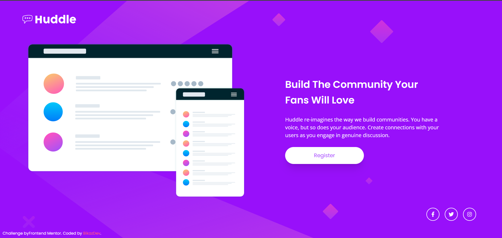

# Frontend Mentor - Huddle landing page with single introductory section solution

This is a solution to the [Huddle landing page with single introductory section challenge on Frontend Mentor](https://www.frontendmentor.io/challenges/huddle-landing-page-with-a-single-introductory-section-B_2Wvxgi0). Frontend Mentor challenges help you improve your coding skills by building realistic projects.

## Table of contents

- [Overview](#overview)
- [The challenge](#the-challenge)
- [Screenshot](#screenshot)
- [Built with](#built-with)
- [What I learned](#what-i-learned)
- [Continued development](#continued-development)
- [AI Collaboration](#ai-collaboration)
- [Author](#author)

## Overview

This is a responsive Huddle landing page built with React and Tailwind CSS. The project focuses on creating a flexible layout, adapting the UI to different screen sizes, and implementing clean component-based structure.

### The challenge

Users should be able to:

- View the optimal layout for the page depending on their device's screen size
- See hover states for all interactive elements on the page

### Screenshot

### Built with

- [React](https://react.dev/) - JS library
- [Tailwindcss](https://tailwindcss.com/) - For styles
- Mobile-first workflow
- Flexbox
- CSS custom properties
- Semantic HTML5 markup

### What I learned

- The most important thing I learned in this project was responsive design and how to adapt the user interface to different screen sizes.
- I improved my understanding of using Tailwind CSS utility classes for positioning and organizing layout elements.
- I learned how to use the `@apply` directive in the `index.css` file to create reusable styles.

### Continued development

In future projects, I want to continue improving my responsive design skills, build more complex layouts, and deepen my understanding of React and Tailwind CSS.

### AI Collaboration

Describe how you used AI tools (if any) during this project. This helps demonstrate your ability to work effectively with AI assistants.

- Tool used: ChatGPT
- How I used it:
  - Debugging layout issues
  - Brainstorming responsive design solutions
  - Improving the project README

- What worked well:
  - It helped me explore different approaches and understand Tailwind CSS concepts better.

- What didn't work well:
  - Some suggestions required manual adjustments to fit the project's requirements.

## Author

- Frontend Mentor - [@bikazDev](https://www.frontendmentor.io/profile/bikazdev)
- X - [@BikazDev](https://x.com/BikazDev)
